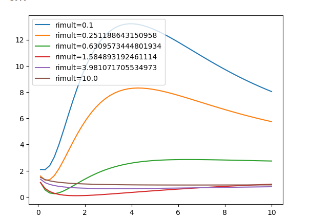
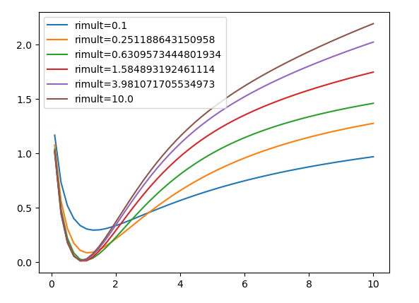

## 2D Test example loss function

### Varying clearance rates

y-axis is loss, x-axis is a non-dimensional number representing scaling of diffusion coefficient, diifferent curves are different clearance rates.

### Varying clearance rates

y-axis is loss, x-axis is a non-dimensional number representing scaling of diffusion coefficient, diifferent curves are surface conductivities.

Assuming that the same pattern holds for real data:

- Initial guess with 0 clearance and a low diffusion scaling prevents divergence.
- Initial guess with high surface conductivity and low diffusion coefficient also also prevents divergence.

